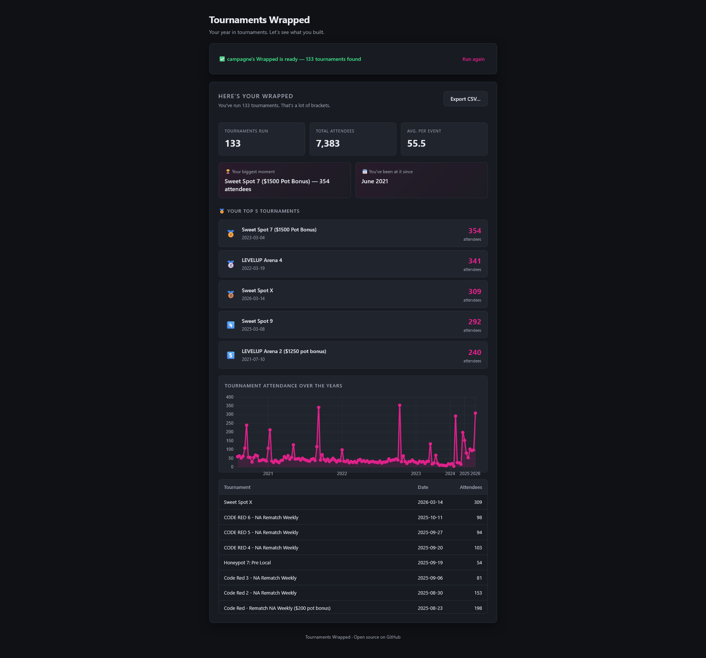

# Tournaments Wrapped

Your tournament history, visualized. Tournaments Wrapped pulls every event you've organized on [start.gg](https://start.gg) and turns it into a stats recap — think Spotify Wrapped, but for tournament organizers.



---

## What it shows you

- 🏆 **Top 5 tournaments** — your biggest events, podium style
- 📊 **Attendance over the years** — a chart of every event you've run
- 📅 **How long you've been at it** — your first ever event date
- 🎯 **Total & average attendance** — across your full history
- 💾 **CSV export** — download everything for your own records

---

## Getting started

### 1. Get a start.gg API token

1. Log in to [start.gg](https://start.gg)
2. Go to **Settings → Developer Settings**
3. Click **Create New Token**, give it a name, copy the value

### 2. Find your user slug

It's the ID at the end of your start.gg profile URL.

```
https://start.gg/user/abc1234d
                      ^^^^^^^^
                      this part
```

### 3. Run the app

Requires **Python 3.10+** and **Git**.

```powershell
git clone https://github.com/camrentm/tournaments-wrapped.git
cd tournaments-wrapped
python -m venv .venv
.venv\Scripts\activate        # Mac/Linux: source .venv/bin/activate
pip install -r requirements.txt
python app.py
```

Your browser will open automatically at `http://localhost:5000`. Paste your token and slug, hit **Unwrap My Stats**, and your Wrapped will load.

Press `Ctrl+C` in the terminal to quit.

---

## Download

Don't want to run from source? Grab the latest `.exe` from the [Releases](https://github.com/camrentm/tournaments-wrapped/releases) page — no Python required.

> **Windows note:** You may see a SmartScreen warning on first launch. Click **More info → Run anyway**.

---

## Project structure

```
tournaments-wrapped/
├── app.py          # Flask server + API routes
├── api.py          # start.gg GraphQL client
├── ui/
│   ├── index.html  # App UI
│   ├── style.css   # Dark theme styling
│   └── script.js   # Frontend logic + Chart.js
├── .github/
│   └── workflows/
│       └── build.yml   # Auto-builds .exe on GitHub release
└── requirements.txt
```

---

## Built with

- [Flask](https://flask.palletsprojects.com/) — local web server
- [Chart.js](https://www.chartjs.org/) — attendance chart
- [start.gg GraphQL API](https://developer.start.gg/) — tournament data
- [PyInstaller](https://pyinstaller.org/) — Windows exe packaging
- [GitHub Actions](https://github.com/features/actions) — automated builds

---

## License

MIT
